# OpenFest 2025


## Automate the Boring Stuff: Creating No-Code* AI Agents with n8n


Automating repetitive tasks is essential for saving time, reducing errors, and
boosting productivity in both personal and business environments. By letting
computers handle the "boring" and repetitive stuff, we (mortal humans) can focus
on creative and strategic work instead of manual data entry, handling notifications,
or doing routine reporting.

n8n is a powerful open-source automation platform that helps users create visual
workflows connecting over 1,100 (including community, custom, and partner) popular
apps and services, from email and spreadsheets to chatbots and AI tools. It enables
self-hosting for complete control, and data privacy, supports custom code for advanced
logic, and offers intuitive drag-and-drop workflow building—no deep coding
knowledge required.

Its main features include:

- opensource
- free*
- private
- self-hosting
- visual workflow design
- support for custom code
- more than 1,100 integrations across business, IT, sales, marketing, data, and AI.

With n8n, we can automate tasks like social media posting, data syncing, project
management reminders, invoice generation, lead tracking, and even AI-powered
customer support.  We can also bridge between business tools that don't offer
direct integration!

Throughout this workshop, we'll see how easy it is to deploy n8n locally using containers,
connect n8n with an external database to enable some advanced functionality
and improved performance, get a free license in the community version for enabling
some of the paid (enterprise) features. We'll explore how easy it is to create
new custom workflows, use the built-in integrations, and create our own automations!

Have fun!


## Prerequisites

The list of prerequisites to complete the workshop is:

>[!Note]
> No matter whether you are using Linux, Mac OS, or Windows, they all come with
> a built-in SSH client in the terminal!

- Personal laptop
- Web browser
- SSH client - built-in like openSSH or third-party like SecureCRT, MobaXterm, Putty, etc.
- Internet connectivity to the cloud infrastructure


## Get familiar with our hands-on environment


The remote lab (hands-on) environment is a virtual machine deployed in the cloud
and is based on Ubuntu Linux 24.04 LTS. It is only accessible over SSH.

The SSH session authentication will be based on the username: `ubuntu`
and an `SSH key` that will be shared with you at the beginning of the event.

> [!Note]
> Please don't change the default credentials!

>[!Warning]
> The handson machines are short-lived and will be destroyed immediately after
> the end of the event. Please don't store any important or sensitive data on them!

>[!Warning]
> Please don't reboot your hands-on VM as this will change its IP address.

The hands-on machine credentials are:

- username: `ubuntu`
- password: `ubuntu`

The built-in user `ubuntu` has regular user privileges. It is a member of the
`sudoers` group, and in case you need to elevate your privileges, you can use the
`sudo` command.

### Connect to the Hands-On Environment

Due to security concerns, SSH requires the private key file permissions to be set
to `400` (read-only for the owner). Let's do that first:

```shell
user@workstation:~$ chmod 400 key.pem
```

>[!Note]
> If you don't change the key permissions, the OpenSSH client might refuse it with
> a warning:

  ```shell
  @@@@@@@@@@@@@@@@@@@@@@@@@@@@@@@@@@@@@@@@@@@@@@@@@@@@@@@@@@
  @    WARNING: UNPROTECTED PRIVATE KEY FILE!              @
  @@@@@@@@@@@@@@@@@@@@@@@@@@@@@@@@@@@@@@@@@@@@@@@@@@@@@@@@@@
  ```

Next, let's log in to our dedicated hands-on machine using an OpenSSH client:

```shell
user@workstation:~$ ssh -i key.pem ubuntu@<hands.on.machine.ip>
~$
```


## Task 1. Configure the hands-on infrastructure

In this task, we'll do the initial environment setup:

- Install Docker CE
- Verify both services are running

### Task 1.1. Install Docker CE

To complete the workshop exercises, we'll need a container engine like Docker CE.

Docker CE is an open-source platform that allows us to develop, ship, and run
applications in containers — lightweight, portable units that encapsulate
everything an application needs to run. It will enable us to create a consistent
environment for running our applications.

To automate the installation of Docker, we'll use a shell script.

>[!Warning]
> Using shell scripts from third parties might be dangerous! Please take a
> moment to review the script content before executing it!


```shell
wget https://raw.githubusercontent.com/DojoBits/Toolbox/main/docker-up.sh
```

Inspect the script:

```shell
less docker-up.sh
```

Then, if everything looks good, let's execute it:

```shell
chmod +x docker-up.sh
sudo ./docker-up.sh
```

> [!Note]
> The script execution might take a few minutes, depending on the machine and
> internet connection speed.

When execution is finished, you'll see:

```shell
...
[INFO] All done! 🎉
~$
```

The Docker CE installation is complete!

### Task 1.2. Verify the services

After the installation script has completed, we should have a working Docker
engine. Let's check it out:

```bash
~$ sudo docker --version
```

If everything works, we should see the Docker version information.

```shell
Docker version 28.5.1, build e180ab8
```

Now, let's check for any running containers:

```bash
docker ps
```

```shell
permission denied while trying to connect to the Docker daemon socket at unix:///var/run/docker.sock: Get "http://%2Fvar%2Frun%2Fdocker.sock/v1.47/containers/json": dial unix /var/run/docker.sock: connect: permission denied
~$
```

We've got a permission error because we use the Docker CLI client as a regular,
unprivileged user.

To fix that, we could either run the Docker CLI client with `sudo` every time, or
add our linux user to the `docker` user group:

```bash
sudo usermod -aG docker $(whoami)
```

To apply this configuration change, we have to log out and log back in
into our shell session, but we can use a small trick to work around that.

We will change our primary group to the docker group and then change it back to
our initial group.

> [!Note]
> This is not a permanent change, and it affects only our current session.

```shell
newgrp docker
```
```shell
groups
```

Output:

```shell
docker adm cdrom sudo dip plugdev lxd ubuntu
~$
```

Let's test again:

```bash
docker ps
```

```shell
CONTAINER ID   IMAGE     COMMAND   CREATED   STATUS    PORTS     NAMES
~$
```

If that workaround doesn't work for you, please try to log out and back in to
apply the group change.


## Task 2. Run n8n inside a docker container


By default, n8n runs with an internal `SQLite` database that is persisted inside a
Docker volume or directory, which is sufficient for evaluations, tests, and
low-volume use cases.

In case we want to connect n8n to an [external db](https://docs.n8n.io/hosting/configuration/supported-databases-settings/), we  can pass the
configuration with the following environment variables:

- DB_TYPE=postgresdb
- DB_POSTGRESDB_HOST=${POSTGRESQL_HOST}
- DB_POSTGRESDB_PORT=5432
- DB_POSTGRESDB_DATABASE=${POSTGRES_DB}
- DB_POSTGRESDB_USER=${POSTGRES_USER}
- DB_POSTGRESDB_PASSWORD=${POSTGRES_PASSWORD}

> [!Note] 
> An external database like PostgreSQL is recommended if we need to
> scale (user concurrency, handle multiple workers with distributed processing),
> run in production (performance), or support multi-user features, among others.


Let's create the directories where we'll persist the n8n data:

```shell
mkdir -p ~/n8n/database
mkdir -p ~/n8n/data
mkdir -p ~/n8n/certs
mkdir -p ~/n8n/files
cd ~/n8n
```

By default, n8n doesn't generate self-signed certificates when a container is created,
so we'll generate one explicitly:

> [!Note] 
> This certificate will be self-signed (untrusted). If you own
> a registered DNS name, it is fairly easy to generate a signed/trusted certificate
> using the free and public Let's Encrypt service through the ACME client. This
> could be done in various ways, including by using a reverse proxy like
> Traefik. This part of the setup we've not included in this workshop, but we
> demonstrate in other workshops, available in our Git organization, which you
> could use as a reference.


```shell
openssl req -x509 -nodes -days 365 -newkey rsa:2048 \
  -keyout /home/ubuntu/n8n/certs/privkey.pem \
  -out /home/ubuntu/n8n/certs/fullchain.pem -subj "/CN=n8n.mydomain.com"
```

Next, we'll define the Docker compose file with the n8n service itself:

```shell
nano compose.yml && cat $_
```

```yaml
services:
  traefik:
    image: traefik:v3.5.3
    container_name: traefik
    restart: unless-stopped
    security_opt:
      - no-new-privileges:true
    ports:
      - 80:80
      - 443:443
    labels:
      - traefik.enable=true
      - traefik.docker.network=n8n-network
    command:
      - --api.dashboard=true
      - --providers.docker=true
      - --entrypoints.websecure.address=:443
    volumes:
      - /etc/localtime:/etc/localtime:ro
      - /var/run/docker.sock:/var/run/docker.sock:ro
    networks:
      - n8n-network

  n8n:
    image: docker.n8n.io/n8nio/n8n:${N8N_IMAGE_TAG}
    hostname: n8n
    container_name: n8n
    restart: unless-stopped
    labels:
      - traefik.enable=true
      - traefik.tcp.routers.n8n.entrypoints=websecure
      - traefik.tcp.routers.n8n.rule=HostSNI(`n8n.mydomain.com`)
      - traefik.tcp.routers.n8n.tls.passthrough=true
      - traefik.tcp.routers.n8n.service=n8n
      - traefik.tcp.services.n8n.loadbalancer.server.port=5678
      - traefik.docker.network=n8n-network
    environment:
      - GENERIC_TIMEZONE=${GENERIC_TIMEZONE}
      - N8N_BASIC_AUTH_ACTIVE=${N8N_BASIC_AUTH_ACTIVE}
      - N8N_BASIC_AUTH_USER=${N8N_BASIC_AUTH_USER}
      - N8N_BASIC_AUTH_PASSWORD=${N8N_BASIC_AUTH_PASSWORD}
      - N8N_ENCRYPTION_KEY=${N8N_ENCRYPTION_KEY}
      - N8N_HOST=${N8N_HOST}
      - N8N_PROTOCOL=https
      - N8N_SSL_KEY=/etc/ssl/certs/privkey.pem
      - N8N_SSL_CERT=/etc/ssl/certs/fullchain.pem
      - N8N_RUNNERS_ENABLED=true
      - N8N_DIAGNOSTICS_ENABLED=false
      - N8N_VERSION_NOTIFICATIONS_ENABLED=true
      - N8N_DIAGNOSTICS_CONFIG_FRONTEND=""
      - N8N_DIAGNOSTICS_CONFIG_BACKEND=""
      - N8N_ONBOARDING_FLOW_DISABLED=true
      - N8N_REINSTALL_MISSING_PACKAGES=true
      - N8N_COMMUNITY_PACKAGES_ALLOW_TOOL_USAGE=true
      - N8N_GIT_NODE_DISABLE_BARE_REPOS=true
      - N8N_BLOCK_ENV_ACCESS_IN_NODE=false
      - N8N_ENFORCE_SETTINGS_FILE_PERMISSIONS=true
      - WEBHOOK_URL=${WEBHOOK_URL}
      - EXTERNAL_FRONTEND_HOOKS_URLS=""
      - DB_TYPE=postgresdb
      - DB_POSTGRESDB_HOST=${POSTGRESQL_HOST}
      - DB_POSTGRESDB_PORT=5432
      - DB_POSTGRESDB_DATABASE=${POSTGRES_DB}
      - DB_POSTGRESDB_USER=${POSTGRES_USER}
      - DB_POSTGRESDB_PASSWORD=${POSTGRES_PASSWORD}
      - LANGFUSE_PUBLIC_KEY=""
      - LANGFUSE_SECRET_KEY=""
      - LANGFUSE_PROJECT_ID=""
      - LANGFUSE_HOST=https://cloud.langfuse.com/
      - NODE_ENV=production
    ports:
      - "5678:5678"
    volumes:
      - /etc/localtime:/etc/localtime:ro
      - ${N8N_DATA_DIR}:/home/node/.n8n
      - ${N8N_FILES_DIR}:/files
      - ${N8N_CERTS_DIR}:/etc/ssl/certs
    networks:
      - n8n-network

  n8n-db:
    image: postgres:17-alpine
    hostname: n8n-db
    container_name: n8n-db
    restart: unless-stopped
    environment:
      - POSTGRES_DB=${POSTGRES_DB}
      - POSTGRES_USER=${POSTGRES_USER}
      - POSTGRES_PASSWORD=${POSTGRES_PASSWORD}
    volumes:
      - ${PG_DATA_DIR}:/var/lib/postgresql/data
    networks:
      - n8n-network

networks:
  n8n-network:
    driver: bridge
```

Let's quickly cover some of the environment variables:

- N8N_BASIC_AUTH_ACTIVE - Enables or turns off basic authentication for accessing n8n.
- N8N_BASIC_AUTH_USER - Sets the username for basic authentication.
- N8N_BASIC_AUTH_PASSWORD - Sets the password for basic authentication.
- N8N_ENCRYPTION_KEY - Encryption key used to protect sensitive data in n8n.
- N8N_HOST - The hostname or IP where n8n will be accessible.
- N8N_PROTOCOL - The protocol (http or https) n8n should use.
- N8N_RUNNERS_ENABLED - Enables execution runners to run workflows in parallel.
- WEBHOOK_URL - Public base URL for generating webhook endpoint URLs.
- N8N_DIAGNOSTICS_ENABLED - Enables or turns off sending anonymous diagnostics data.
- N8N_VERSION_NOTIFICATIONS_ENABLED - Enables or turns off notifications about new versions.
- EXTERNAL_FRONTEND_HOOKS_URLS - URLs for external frontend hooks integration.
- N8N_DIAGNOSTICS_CONFIG_FRONTEND - Frontend diagnostics configuration details.
- N8N_DIAGNOSTICS_CONFIG_BACKEND - Backend diagnostics configuration details.
- N8N_ONBOARDING_FLOW_DISABLED - Disables the onboarding flow for new users.
- N8N_REINSTALL_MISSING_PACKAGES - Automatically reinstalls missing packages for workflows.
- N8N_COMMUNITY_PACKAGES_ALLOW_TOOL_USAGE - Allows usage of community packages/tools.
- LANGFUSE_PUBLIC_KEY - Public API key for Langfuse integration.
- LANGFUSE_SECRET_KEY - Secret API key for Langfuse integration.
- LANGFUSE_PROJECT_ID - Project identifier for Langfuse integration.
- LANGFUSE_HOST - Base URL for the Langfuse service.
- NODE_ENV - Sets the environment mode. Used by JavaScript and Node.js apps (including
  n8n). When set to `production`, n8n and its dependencies can enable optimizations,
  disable debug-level logging, set secure defaults, etc. We can also set it to
  `development`.

> [!Note] 
> Langfuse is an open-source LLM (Large Language Model) engineering
> platform that provides end-to-end observability, collaborative prompt management,
> structured evaluation pipelines, tracing of API/model calls, dataset management,
> and analytics like cost, latency, and quality. Inside n8n Langfuse enables
> teams to trace and analyze language model usage in workflows, manage and version
> prompts, and inject contextual metadata (such as session and user IDs) for
> debugging and improving AI-driven automations. This integration helps make
> LLM-based automations reproducible, measurable, and more reliable at scale
> https://github.com/langfuse/langfuse

The complete list of available environment variables is documented [here](https://docs.n8n.io/hosting/configuration/environment-variables/).


As part of our setup, we'll provide a value for the N8N_ENCRYPTION_KEY. That
is a 32-byte random string used to encrypt and decrypt sensitive credentials securely
(api tokens, passwords, logins, etc.) that are stored inside the n8n database:

> [!Warning]
> Changing or losing the encryption key will lock the stored credentials
> and it will have to recreate them!

```shell
openssl rand -hex 32
```

```shell
319400d1ec5486f04c05f73b3db525b77c83af119987b6d7ca96b04b0f26252c
$
```

Our compose file uses parameter references. We'll store them inside an .env file. Please don't forget
to update your encryption key!

```shell
nano .env && cat $_
```

```shell
N8N_IMAGE_TAG=1.115.1
N8N_BASIC_AUTH_ACTIVE=true
N8N_BASIC_AUTH_USER=dojo
N8N_BASIC_AUTH_PASSWORD="OpenFest2025!"
N8N_HOST="n8n.mydomain.com"
N8N_DATA_DIR=/home/ubuntu/n8n/data
N8N_FILES_DIR=/home/ubuntu/n8n/files
N8N_CERTS_DIR=/home/ubuntu/n8n/certs
WEBHOOK_URL="https://n8n.mydomain.com"
N8N_ENCRYPTION_KEY="<encryption_key>"

POSTGRES_DB=n8n
POSTGRES_USER=n8n
POSTGRES_PASSWORD="OpenFest2025!"
POSTGRESQL_HOST=n8n-db
PG_DATA_DIR=/home/ubuntu/n8n/database

GENERIC_TIMEZONE=Europe/Sofia
HOMEPAGE_ICON=https://cdn.jsdelivr.net/gh/homarr-labs/dashboard-icons/svg/n8n.svg
HOMEPAGE_URL="homepage.mydomain.com"
HOMEPAGE_GROUP="Work"
```

Finally, let's start the n8n service:

```shell
docker compose up -d
```

```shell
[+] Running 3/3
 ✔ Network n8n_n8n-network  Created                                             0.1s
 ✔ Container n8n            Started                                             0.6s
 ✔ Container n8n-db         Started
 $
```

We can validate the n8n logs from the docker container:

```shell
docker logs -f n8n
```

```shell
Initializing n8n process
n8n ready on ::, port 5678
n8n Task Broker ready on 127.0.0.1, port 5679
[license SDK] Skipping renewal on init: license cert is not initialized
Registered runner "JS Task Runner" (9DRthD-DsjmPFlbJmiLX0)
Version: 1.115.1

Editor is now accessible via:
https://n8n.mydomain.com
$
```

The `-f` (follow) docker option trigger continuous watch for new container logs.
To exit and return back to the shell, press `CTRL+C`.

During the setup, we've generated a self-signed certificate and configured the
N8N_HOST environment variable (used for public access for webhooks, redirects, etc).
If we have control over the DNS server, we could create an 'A' record (and PTR) for our
n8n instance so that the name could be resolvable. In our hands-on environment,
though, we don't have a dedicated DNS server.

If you want to test the access to the N8N server from the hands-on machine using
its DNS name, please run the following command to update the local resolver configuration:

> [!Note]
> Please substitute the <Hands-On-IP> placeholder with your hands-on machine IP address

```shell
echo "<Hands-On-IP> n8n.mydomain.com" | sudo tee -a /etc/hosts
```

This will create a new record in the `/etc/hosts` file. Now we can test the connection
using the `curl` command:

```shell
curl -k https://n8n.mydomain.com:5678
```

You should get a similar output (truncated here):

```html
<!DOCTYPE html>
<html lang="en">
	<head>
		<script type="module" crossorigin src="/assets/polyfills-BhZQ1FDI.js"></script>

		<meta charset="utf-8" />
		<meta http-equiv="X-UA-Compatible" content="IE=edge" />
		<meta name="viewport" content="width=device-width,initial-scale=1.0" />
		<link rel="icon" href="/favicon.ico" />
		<meta name="n8n:config:rest-endpoint" content="cmVzdA=="><meta name="n8n:config:sentry" content="eyJkc24iOiIiLCJlbnZpcm9ubWVudCI6ImRldmVsb3BtZW50IiwicmVsZWFzZSI6Im44bkAxLjExNS4xIn0=">
...
$
```

To access the n8n web UI running on the hands-on machine from our personal laptop,
we have a few options:

- use the hands-on machine ip address - no changes required
- use the n8n domain name - need to update our local machine resolver configuration
  as follows:
  - If your personal machine, from where you are doing the workshop, is based on Linux
  or Mac OS executes the same command we've used on the hands-on machine to update
  it's the host file from the console.

  - If your personal machine is Windows-based:
    - Press the Windows key
    - Type `Notepad` in the search field.
    - In the search results, `right-click` Notepad and select `Run as Administrator`.
    - From Notepad, open the following file: `c:\Windows\System32\Drivers\etc\hosts`
    - Scroll down to the bottom of the file and add a new line:

      ```text
      <Hands-On-IP> n8n.mydomain.com
      ```

    - After adding your entries, save the file by going to `File > Save` or pressing
      `Ctrl + S`.
    - Close Notepad

> [!Note] 
> As we are using a self-signed certificate for this workshop, it doesn't
> really matter which approach you would prefer

Let's now try to access the n8n web UI for the first time. In a web browser
on your local machine, open the following url:

- [https://n8n.mydomain.com:5678](https://n8n.mydomain.com:5678) - if you've updated
  your local hosts file
- [https://\<Hands-On-IP\>:5678](https://<Hands-On-IP>:5678) - if prefer using IP


Your web browser will issue a warning about the certificate. Please acknowledge it
and proceed. You'll land on the n8n setup-up owner/admin account page:

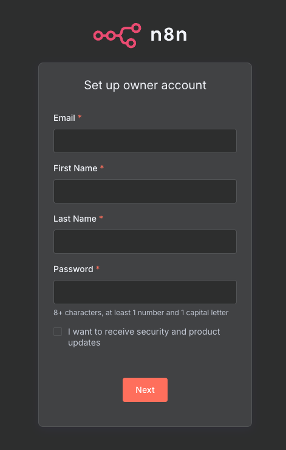


- Email: `operations@dojobits.io`
- First Name: `n8n`
- Last Name: `handson`
- Password: `OpenFest2025!`

Fill in the form fields and click `Next`. We'll now be redirected to the n8n
overview page:

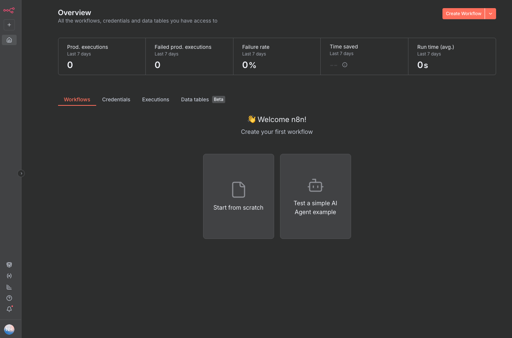


## Task 3. n8n licensing

n8n is an open-source (source available) project. It is a node-based workflow
automation platform that anyone
You can self-host for free, and the entire source code is publicly available on [GitHub](https://github.com/n8n-io/n8n). 
By October 2025, it had more than 147k stars, and it had been forked over 45.6k times!
Organizations and developers use n8n for building automations, integrations, and
AI-powered workflows with complete control over their data and deployment.

You can get the exact licensing terms [here](https://github.com/n8n-io/n8n?tab=License-1-ov-file#readme)

Limitations:

```text
You may use or modify the software only for your own internal business purposes or for non-commercial or personal use. You may distribute the software or provide it to others only if you do so free of charge for non-commercial purposes. You may not alter, remove, or obscure any licensing, copyright, or other notices of the licensor in the software. Any use of the licensor’s trademarks is subject to applicable law.
```

The n8n Sustainable Use License permits free self-hosted
use for internal business, personal, or non-commercial purposes, but restricts
resale and commercial distribution. Commercial use as part of a paid product,
SaaS, or hosting service, requires a separate enterprise license from n8n.

The n8n Community Edition license is available by registering with an email address at
[https://license.n8n.io](https://license.n8n.io). Applying this license unlocks
some enhanced features in the Community Edition, such as:

- Organize workflows into a nested folder structure
- use workflow history - Review and restore any workflow version from the last 24 hours
- workflow debugging in the editor
- execution search and tagging - Search and organize past workflow executions for easier review

The complete list of `registered community edition` features could be found [here](https://docs.n8n.io/hosting/community-edition-features/#registered-community-edition)

The license key can be activated directly in the n8n UI. From the left sidebar,
click on the user icon (bottom-most icon) -> Settings. The `Usage and plan` page
will appear. Inside, you could click on the `unlock` link. A pop-up window will appear
`Get paid features for free (forever)`. You can share an email address on
which you'll receive an activation code.  Click `Send me a free license key`
to confirm. If you already have the key, you can use the `Enter activation key`
button from the `Usage and plan` page to enter it.

> [!Note] 
> In this workshop, we'll be using mostly the `non-paid` features, but we'll
> also reference some of the features requiring a community license to
> demonstrate the available functionality.

> [!Note]
> In case you decide to apply for a free license key, it might take
> a few minutes until you receive a confirmation email with the key.


## Task 4. Getting Started with n8n - our first automation workflow

Before we dive deeper into n8n, let's start with some fundamental terminology
that we'll be meeting often:

> [!Note]
> Please feel free to skip those if you are already familiar

- `Automation`: The process of using technology (like n8n workflows) to perform
  repetitive or routine tasks without manual intervention, improving efficiency
  and consistency. Includes a pre-defined logic.
- `AI Agent`: An autonomous or semi-autonomous software component that uses
  artificial intelligence to analyze data, make decisions, or perform actions—often
  integrated into n8n workflows for tasks like enrichment, summarization, or
  personalized messaging. AI agents usually rely on three components:
  - Brain - An LLM (large language model) like Claude, Gemini, or ChatGPT. It is
    responsible for reasoning and text generation
  - Memory - stores the context - tracks conversations, past interactions, pools
    data from external data sources, like documents or databases.
  - Tools - Enables interactions with the outside world - retrieving data, taking
    an action - executing a command, making an api call, triggering a workflow,
    calling another agent, etc.
- `System Prompt` - an initial set of directives used to guide an AI agent or
  language model’s behavior, defining what it should do, how it should respond,
  and what resources it can use. It sets the background framework for automated
  reasoning and task performance and usually consists of the following major components:
  - `role`: Specifies the identity or persona the AI should adopt (e.g., assistant,
    teacher, specialist).
  - `instructions`: The explicit guidelines and tasks the AI must follow, outlining
    expected actions, response styles, or priorities.
  - `tools`: Lists the available resources or functions (such as APIs, databases,
    web search) that the AI is allowed to use to perform tasks.
  - `context`: Provides background information, user history, recent conversation,
    or relevant data to help the AI understand and operate effectively.
  - `restrictions`: Details any limitations imposed—topics to avoid, privacy
    boundaries, prohibited actions, or response filters.
  - `goals/objectives`: Clarifies the primary aim(s) that should guide the AI’s
    responses.
  - `output format`: Specifies how responses should be structured (e.g., bullet
    points, JSON, Markdown).
  - `fallback procedures`: Instructions for handling uncertainty, errors, or
    unanswerable questions.
  - `feedback mechanism`: Defines how the AI should update its behavior in
    response to user or system corrections.
  - `Examples`:  Clarify the expectations for the AI, showing an ideal response
    formats, tone, or specific ways to handle typical queries.
- `Node`: A single step in a workflow, such as sending an email, querying a
  database, or making an API request.
- `Trigger`: The starting event that runs a workflow (e.g., webhook, schedule,
  new email).
- `Workflow`: A series of connected actions (nodes) that automate a process from
  start to finish.
- `Connection`: The link between nodes, determining the flow and data passed along.
- `Credential`: Securely stores sensitive data like API keys, passwords, etc., for
  connection to external services.
- `Execution`: A single instance of a workflow running from trigger to completion.
- `Variable`: Data stored and passed between nodes. May hold numbers, text, arrays,
  or objects.
- `Expression`: A dynamic formula or code snippet (often JavaScript) that calculates
  or references values in the workflow.
- `Branching`: Split the workflow to follow different paths based on conditions or logic.
- `Parameter`: Specific configuration for a node—what it does, which data it uses, etc.
- `Human in the loop`: Workflow pauses for manual review or input before continuing.
- `API`: Application Programming Interface – an interface that enables applications
  to make their functionality and data remotely accessible to other programs or
  services. Sorta like a microwave - you put your snack (your data) and press a
  button (make an API call to use the popcorn feature), then the machine starts heating
  your popcorn (process the request), finally, when done (usually in milliseconds),
  you get the response - audible and visual notification with the processed
  response (very hot snack).

n8n is node-based workflow automation. We build workflows by connecting individual
nodes and pass data through them. Currently, there are more than 350 built-in nodes
in n8n, but we could vaguely group them in some high-level categories based on
their purpose:

- `Trigger nodes` - initiate a workflow (on click, chat, webhoo, chat message, etc.)
- `Application integration nodes` - take an action in the application (Google Suite,
  github, aws... ). Those are pre-configured API clients for the respective apps.
- `HTTP Request node` - universal REST API client - allow integrations with apps
  for which we don't have built-in actions
- `Data processing nodes` - transform or manipulate the data flowing through the
  workflow - for example, `Edit Fields(set)`, `Merge`, `Code`, etc.
- `Logic and branching nodes` - control data flow - filter, branch, loop, wait
  ( if ... then, for, etc.)
- `AI and LLM nodes` - adds brain, memory, tools - enable us to connect to a language model,
  adds memory, allows us to attach `tools`. We can give it `goals` and instructions.
  It can determine which tools to use based on the input data and the model's reasoning.
  We can do content generation, summarization, RAG, etc.
- `Output nodes` - Enable sending data and notifications through emails, messaging
  apps, etc.
- `File and Database nodes` - Read/Write data from disk files, cloud storage
  (Google Drive...), read/write records into databases (Airtables, PostgreSQL,
  MySQL, MongoDB...)
- `Human in the Loop nodes` - enable workflows to pause for manual review, approval,
  or intervention before proceeding. Use cases include implementing the 4-eye principle
  during review, automated invoice processing, calendar conflict resolutions,
  AI-generated action approval (executing shell commands, generating mails, etc.)...


## Task 4.1 n8n templates


An easy way to get started with n8n automation workflows is to use pre-made blueprints
(templates) that we can customize and adapt to our needs. n8n templates are
pre-built, ready-to-use workflow blueprints designed to help users automate everyday
business, technical, or creative tasks quickly and easily. Templates provide the
foundational steps for an automation, showing how to connect various apps and
services using n8n nodes, triggers, and logic components.

Some of the advantages of using templates are:

- Save time on setup and best practices
- Learn how to structure robust workflows
- Customize automations for their own specific needs

n8n templates serve as both time-saving solutions and practical learning tools,
empowering anyone, regardless of coding experience, to start automating with n8n.

Where can we find pre-made templates?  The n8n website has a [template catalog section](https://n8n.io/workflows/)
with over 6000 templates, split into multiple categories:

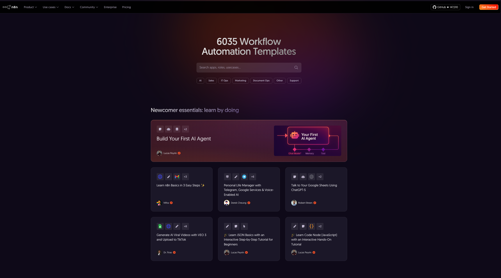

Another good alternative is github. Check the Github Topic [#n8n-templates](https://github.com/topics/n8n-template)
which returns multiple repositories with curated n8n templtes, like: [Awesome n8n templates](https://github.com/enescingoz/awesome-n8n-templates)


> [!Warning] 
> The quality of the pre-made templates might vary. Some of the
> templates may seem confusing, have issues, or be missing some functionality.

## Task 4.2 Using n8n templates

Let's see how we can use templates. We'll start by looking for a template called:

```text
Daily Weather Reports with OpenWeatherMap and Telegram Bot
```

Inside the n8n workflow catalog page, type the above template name.

> [!Note] 
> You could also search by a keyword in the catalog or by category.
Look around and explore what is already available.

The template we are [looking for](https://n8n.io/workflows/?q=+Daily+Weather+Reports+with+OpenWeatherMap+and+Telegram+Bot) should be the first one in the result:

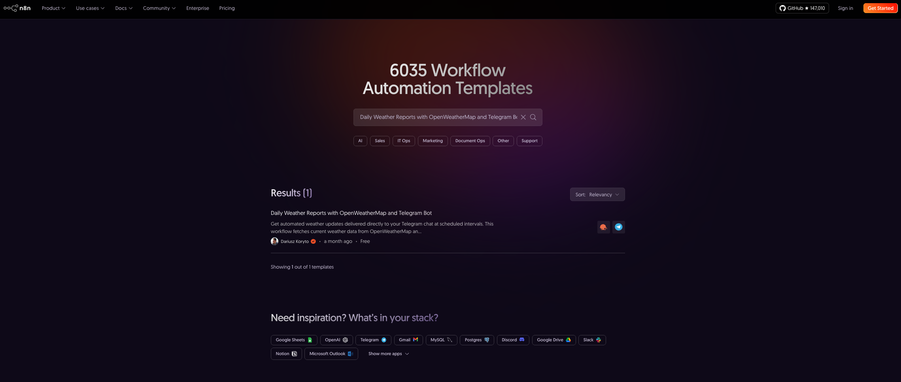

Click on the template name from the result to open the [template page](https://n8n.io/workflows/8162-daily-weather-reports-with-openweathermap-and-telegram-bot/):

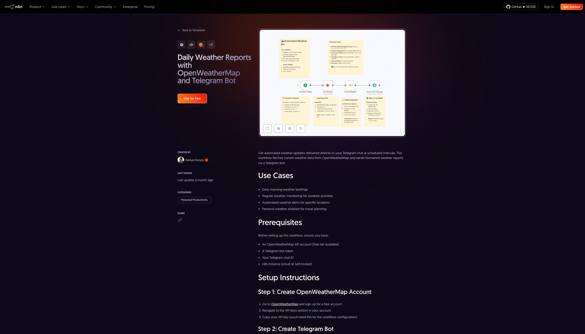

On this page, we can see who the author is, and the red checkmark next to his name
indicates that he has been verified (a form of recognition that he produces
consistently high-quality workflows and templates that are well reviewed). At the
top of the page, there is an interactive card showing what the workflow looks like.
We can pan, zoom, and move around to gain a better understanding of the workflow components.
Below is the documentation of the workflow - what it does, what problems it solves,
prerequisites for using it, and instructions on how to configure it. Please take a brief
look at the page before we proceed.

Next, let's see how we can use that template. Of course, as with every script downloaded
from the internet, it is a good practice to verify first. Let's create a scratch folder:

```shell
mkdir -p ~/n8n/dev && cd $_
```

where we could create a file and temporarily store the content of the workflow:

```shell
nano daily-weather-reports.json
```

Back to the n8n workflow template page inside your browser, click on the red button
below the template name: `Use for free`. In the `Use template` pop-up, click on
the first option: `Copy template to clipboard [JSON]`, then paste it inside your
terminal window with the opened nano editor.

> [!Note] 
> If you prefer, you could also use a local text editor like Notepad on
> your machine.

We are not going to spend much time here, as we are going to work mainly with the
n8n web ui, but it is worth having an idea of how the templates are represented and
how to quickly review them prior importing them into your environment.
The template body is serialized as a top-level JSON object, containing all the
workflow’s nodes, triggers, connections, and settings. Here is a brief description
of the properties you'll typically find inside the template:

- name: The workflow's display name.
- nodes: An array with each node (action/trigger/operation) object detailing the
  node's type, parameters, ID, and display settings.
- connections: An object representing how nodes are linked.
- active: Boolean indicating if the workflow is enabled.
- settings: Workflow-level settings (optional).
- tags: Categorization tags for template browsing or search.
- credentials (optional): Credential references if nodes require them (note: sensitive
  info is not included, only references)

Now, let's get back into the n8n Web UI:


From the home screen, click on the `Start from scratch` card. A new empty workflow
will be created. If the n8n template body is still in your clipboard, paste
its content inside the browser window (Ctrl+V, for example). The Workflow will now
be visualized:

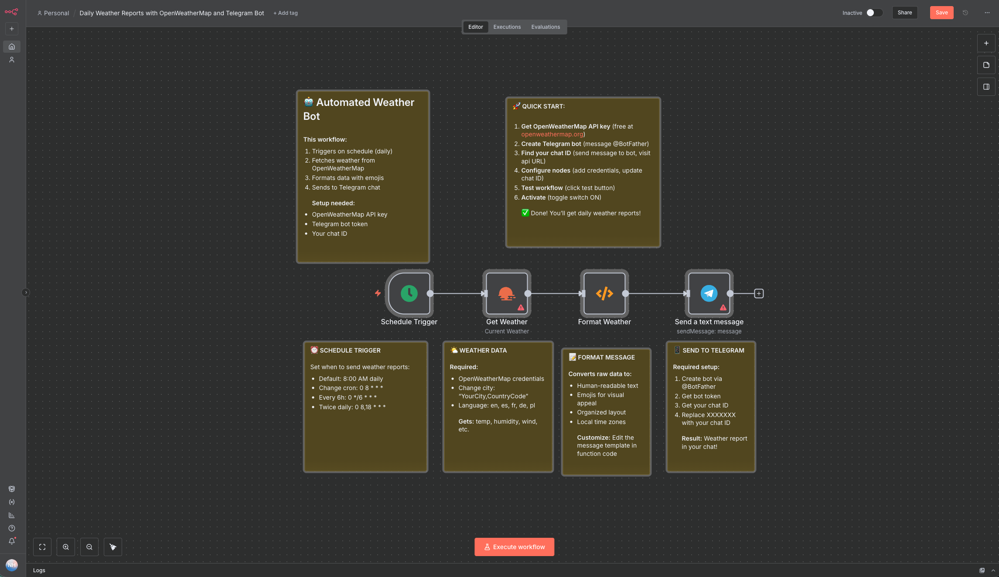

First, let's click on the `Save` button in the upper right-hand corner of the screen
to make sure we've actually stored its content. We've just stored the workflow
using the default name from the template. This is also the name under which
we could find it later on in the home screen under the `Workflos` tab.
Let's quickly check our workflow. It consists of four nodes, each of which has
a distinct task in the automated workflow:

- `Schedule Trigger` node - used to trigger the workflow automatically at specific
  times (e.g., once daily in the morning), start the weather reporting process.

- `OpenWeathMap` node, called Get Weather -  Fetches current weather data for the
  specified city. This node connects to the OpenWeatherMap API and pulls the relevant
  weather information.
- `Code Node` called Format weather - Processes and formats the raw weather data
   into a human-readable, emoji-enhanced report suitable for sharing via messaging
   apps. We are going to explain how the code block defined inside actually works
   .
- `Telegram node` called Send a text message - Sends the formatted weather report
  as a text message to a designated Telegram chat using the Telegram Bot API.

Around the core workflow nodes, there are several `Sticky Note` nodes -
`Automated Weather Bot`, `Quick Start`, etc. They are used to document
our workflow visually - What is the purpose of the workflow, how to configure it, and what
each node inside the workflow does.

As mentioned in the Workflow Template prerequisites and also on the Quick Start
note, before we start using the workflow, we have to:

- Get the credentials for OpenWeatherMap and Telegram, including the chat ID
- Provide the credentials to the workflow nodes.
- Manually validate the workflow by manually triggering it
- Change the Workflow state from `Inactive` to `Active` to enable the
  automated workflow execution whenever the trigger node (schedule) condition is met.

 > [!Note] 
 > When a workflow is activated, n8n starts continuously monitoring for events,
 > schedules, or triggers that would start the workflow without requiring manual
 > intervention. Newly created workflows are inactive by default. Switching to
 > the active state enables the automation.


To use the OpenWeatherMap node, we need to create a free account and generate
an API key. More details on how to generate one can be found [here](https://openweathermap.org/appid)

- Sign up for a free account using this [url](https://home.openweathermap.org/users/sign_up)
- On the home page, navigate to the `API keys` section
- Under `Create key`, provide a key name, for example: `n8n`, and then click `Generate`

Leave the OpenWeather browser tab open. We'll need the generated api key in a moment.

Next, let's get the required Telegram credentials from within the Telegram app.

> [!Note] 
> For this step, we'll need a telegram registration. This can be done on
> a cell phone by installing the Telegram app from the Play or App store, or using
> Telegram Desktop app (the registration requires a SMS verification code (usually free)).

Within the Telegram App search bar, look for a chat called `BotFather` - the one
bot to rule them all... Click `START` to start a new chat with it. Type `/newbot`
in the message field to create a new bot. We'll see a response:

`Alright, a new bot. How are we going to call it? ..`

Pick up a name, for example, `senpai`. Type it and send it. Next, we are asked to
choose a username for the bot that goes with the `bot`. Pick up a name ending
with bot, like `noodle_ninja_bot` (this name has to be unique). All done! Copy
the token under the section: `Use this token to access the HTTP API:`. Next, click
on the new bot link from the beginning of the message next to: `You will find it at`.
This will open a new chat with our newly created bot. Click on the `START` button
to begin the chat. Type any text message, for example, `test`. Next, to get 
the required `chat id`, open a new browser tab and paste the following url after
replacing the `<your_token>` section with your actual bot token we've just received:

```text
https://api.telegram.org/bot<your_token>/getWebhookInfo
```

The response should look something like this:

```text
{"ok":true,"result":[{"update_id":217*****2,
"message":{"message_id":2,"from":{"id":89***593,"is_bot":false,"first_name":"Miyamoto","last_name":"Musashi","username":"MiyamotoMusashi","language_code":"en"},"chat":{"id":894***93,"first_name":"Miyamoto","last_name":"Musashi","username":"MiyamotoMusashi","type":"private"},"date":1760051545,"text":"Test"}}]}
```

The chat ID is the string in this section: `"chat":{"id":89****93,` - 894***93.

With this, we should have all the prerequisites in place. Let's get back to the
n8n workflow, review the individual nodes, and then update them with the missing
configuration.

Click on the Schedule Trigger node. On the `Parameters` tab, we see that currently
no trigger times are configured. This means that this trigger node will not
automatically activate the workflow, even if the workflow is enabled. Click on
the `Add Cron Time` button to fix that. With OpenWeatherMap, we have a limit
of 60 requests per minute and 1000 requests per day. This means we can send
a request every 3 minutes. To test the workflow, we'll initially set the workflow
to trigger every 5 minutes, then we'll set it to trigger at a specific hour.

Under `Tigger Times`, set mode to `Every X`, with value to `5` and unit to `Minutes`.

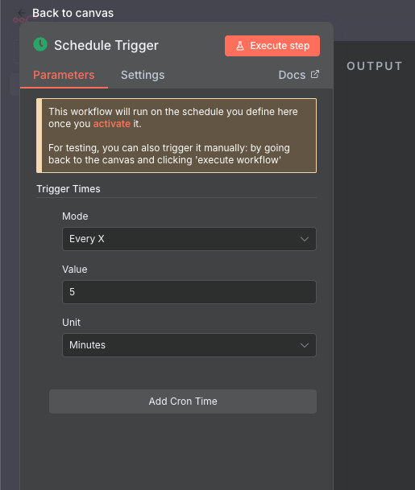

> [!Note] 
> You can add multiple trigger times. Just click on the `Add Cron Time`
> button set them accordingly

Navigate back to the main canvas by clicking on the `Back to canvas` button in the
upper left-hand corner.

Next, we'll visit the Get Weather node. This is the node that is authenticating
against OpenWeatherMap and retrieving the weather information. Тhe `Parameters`
tab is where we provide the required configuration. The `Select Credential`
field is highlighted in red because it is not populated, and it is required.
From the drop-down menu, select `Create new credential`. In the pop-up window,
enter the OpenWeatherMap API token we've generated earlier, then click on the
`Save` button in the upper right-hand corner. If everything works, you'll see
a green banner, confirming the connection was successful:

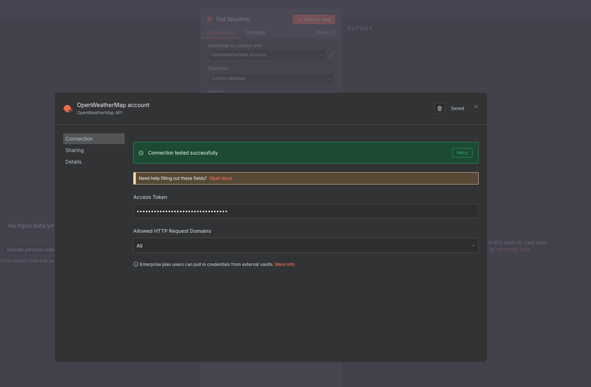

Close the pop-up by either clicking outside of its box or on the `X` icon in the
top right corner. Next, we'll change the City. Under the `City` field, specify
the desired city, for example, `Sofia,BG`. Click on the `Execute step` button at
the top of the window:

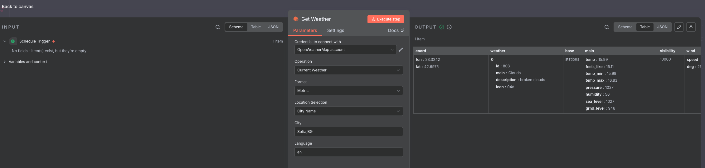

On the right-hand side, in the `OUTPUT` section, we see the information that
we've received back from the cloud service - coordinates, weather description,
temperature, etc., in a Table form. Check out the other two forms as well - the
schema view and the JSON view for representing the returned data. To the left
of the `Schema` tab, there is a looking glass icon. Click on it to reveal a
search field where you can quickly look for keywords inside the output.
To the right, there is a pencil icon. This allows us to manually modify or set
the output data in case we need some mockup values to work with. The most
right-hand side icon is a pin button. We can use it to `freeze` the current
output data from a particular node. This option is helpful when developing or
debugging issues with the workflow. The node will not try to fetch fresh data, 
potentially causing you to hit the rate limit of the remote service, but rather
keep passing the currently configured output data. Using this option is also handy
when an external system triggers your workflow and you don't want to use
it every time you test your workflow.

> [!Note] 
> When data pinning is active, a banner appears at the top of the node's
> output panel indicating that n8n has pinned the data. To unpin data and fetch
> fresh data on the next execution, select the Unpin link in the banner.

Let's return to the main canvas by clicking on the `Back to canvas` button. Notice
the green check mark in the bottom right-hand side of each workflow node. It means
that the node has executed successfully during the last test or run.

Let's now visit the `Format Weather` node. To the left, we see the input data
that has been passed from the previous node (Get Weather). Again, we have three
different views we can choose from - schema, table, or json. In the middle, we have
the JavaScript Code block. It allows us to work programmatically with the input
data and manipulate it. Here comes the `Almost node code*` part of the hands-on
abstract. Having a bit of programming knowledge can help us a lot
in doing interesting data manipulations, filtering, and formatting the data in just
the right way we need it.

> [!Note]
> If you don't have any programming experience, you can use a
> trusted AI assistant to reason about the code, modify it, or generate it altogether.

> [!Warning]
> Even the bigger models are not perfect and sometimes they do make
> mistakes. Please test such code thoroughly before using it.

Quick code overview. We receive the input data in the json serialization form
(data formatting optimized for machine processing). The input data contains a list
represented by the square brackets "[]". Inside the list, we have a single dictionary
(key:value pair structure). On the first line of our code block, we extract the
dictionary's single element 0. Down in the script, we define a function  called
`formatTime` that converts a UNIX timestamp (in seconds) plus a timezone offset
(also in seconds) to a formatted time string in hh:mm (24-hour) format.
Down the script, we do further lookups of the weather data now stored in the
constant called weather, using the dot `.` notation to reference sub-fields.
For example: `weather.main.temp_max.toFixed(1);` references the value of key
`main` -> subkey `temp_max` and returns a string rounding the value to a single
decimal place. Having the data in the desired format assigned to multiple constants,
we compose the message that we'll be sending to our messaging client (Telegram),
by assigning the `constant message` the string with the desired text and references
to the constants that hold the actual data. Before the message is passed to the
next node, the references to the constants (like ${sunset}) will be dynamically
replaced with the actual values.

> [!Note]
> In programming, call this dynamic replacement of value references (placeholders)
> string interpolation

We finish the mini script with the statement:

```javascript
return [{ json: { message } }];
```

In an n8n code or function node, it is used to output data to the next node in the
workflow. Specifically, it creates an array with a single item, where the data is
structured under the json property as { message: ... }. This is the required format
for passing structured JSON data between nodes in n8n workflows.

Let's test whether it works. Click on the `Execute step` button:

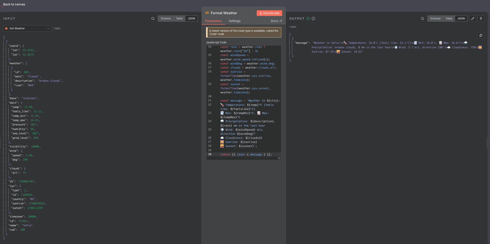

In the `OUTPUT` section, we should now see a JSON-serialized structure with a
key called `message` and the value, the string we've returned by our return
statement.

Click on `Back to canvas` to return to the main workflow. We've one more node
to configure - `Send a text message`. Click on it to open its configuration.
For this node, we have to create a new credential (from the credential drop-down menu)
and populate the access (API) token we've got from our Telegram chat. Upon clicking
`Save`, you should get a confirmation that the connection was tested successfully.
close the credential dialog (X). In the main `Send a text message` node settings
window, set the value for the Chat ID that we've extracted earlier. Click on
`Execute step` to test the configuration.

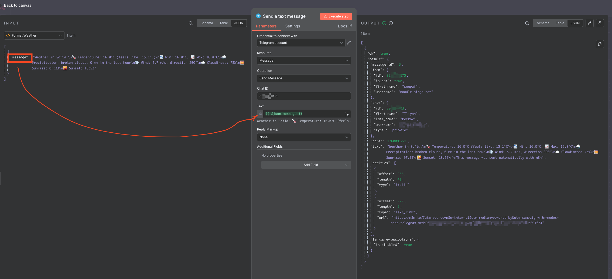

It worked! Check on your phone, you should have a new message!

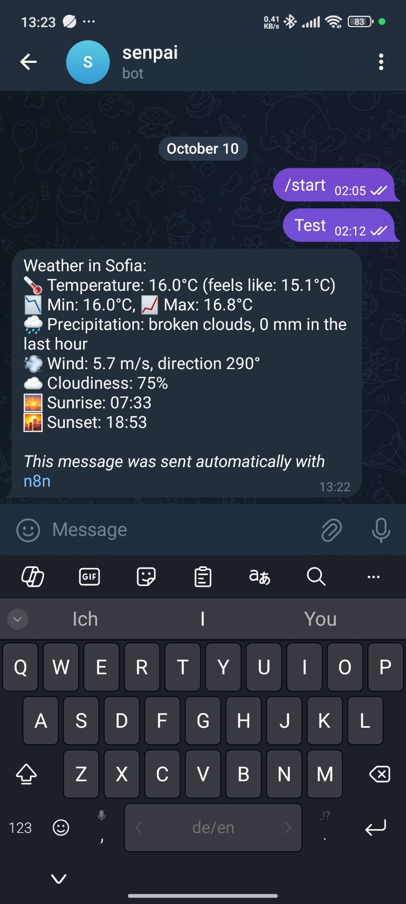

Before we move on, let's quickly re-examine the node parameters,
specifically in the `Text` field. This field contains the data (message) that
we want to send to our messenger. Notice the value `{{ json.message }}` This is
an expression that dynamically inserts the current value of the message property
from the input data of the node.​

- The double curly braces ({{ ... }}) tell n8n to evaluate the contents as a
  JavaScript expression, rather than treating it as plain text.
- When the workflow runs, n8n replaces {{$json.message}} with the value found in
  the message property within the current item's JSON data structure.

This technique lets nodes reuse and pass along output from previous nodes in a
workflow.

> [!Note]
> you don't have to write that {{ }} expression manually. Erase the
> content of the `Text` field, click with your mouse on the `message` keyword
> in the INPUT section, and drag it over the `Text` field. The field will automatically
> populated. We could use this technique in multiple places across the n8n
> web ui to quickly reference input parameters.

Return to the main canvas `Back to canvas`. We've just finished configuring our
first n8n workflow! Now that we've validated the workflow and we are satisfied
with the results, we can activate the workflow by flipping the `Inactive` toggle
in the upper right corner of the screen. A warning will pop up `Workflow activate`.
Please read the message and acknowledge it. Click `Got it`. The state will change to `Active`
the `Save` button will be grayed out (workflow was saved), but another field appears
on the left `0/2`. When you click on it, a new pop-up will appear - `Workflow Settings`.
This enables us to fine-tune how our workflow executes, logs data, handles errors,
sets timeouts, and manages other critical operational details. Let's review the
options:

- `Execution Order`: Selects the execution version or strategy for running the workflow
- `Error Workflow (to notify when this one errors)`: Lets us choose another workflow
  that will be triggered to handle or notify us in case this workflow encounters an error.
- `Timezone`: Sets the timezone that the workflow should use for all date/time
   operations and triggers.
- `Save failed production executions`: Defines whether failed executions should be
  saved to the system log/database for troubleshooting.
- `Save successful production executions`: Specifies if successful workflow runs
  should be stored for later review or auditing.
- `Save manual executions`: Determines if executions are triggered manually (not on "
  schedule or via trigger) should be saved.
- `Save execution progress`: Controls whether the step-by-step progress is stored
  during the workflow execution, which helps debug long or complex flows.
- `Timeout Workflow`: Lets us specify a workflow to run if this one exceeds a
  defined execution time (times out).
- `Estimated time saved`: Lets us enter the estimated time our workflow saves per
  execution; this is optional and used for analytics or reporting purposes.

Let's tweak it a bit and save it:

> [!Note]
> We don't have an Error Workflow at this point

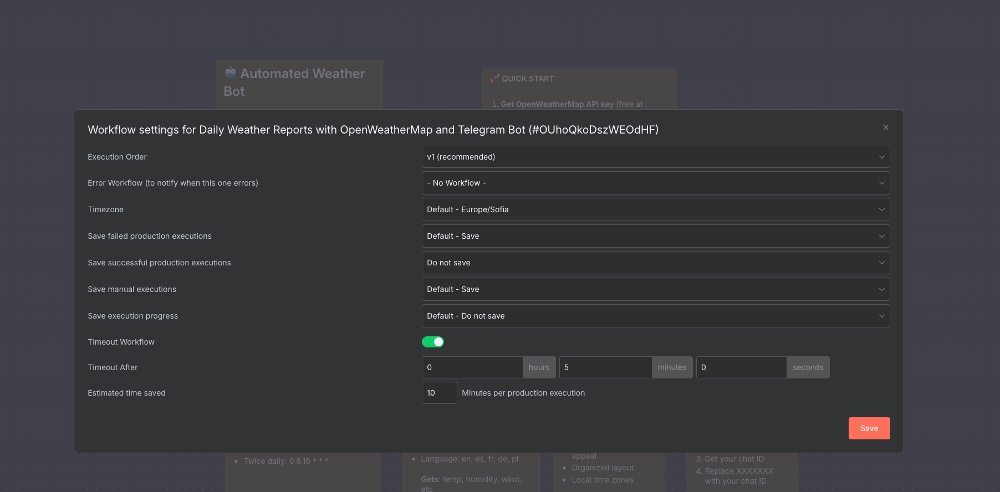


Do we miss something? Right! Please check whether you've received automated notifications
on your Telegram client. You should have, but getting them every 5 min is way
too much.

Challenge: Get back and update the workflow so that it is triggered once per day
at a specific time. For example, 7:30 am.

Well done! We've just created our first workflow, but perhaps we could make it
a bit more useful?


## Task 5 n8n agents

In the previous task, we created a basic n8n workflow that uses fixed logic
from triggering to completion. There are situations, however, where we want
to utilize the power of LLMs (large language models) and their tool-calling
capabilities through custom AI Agents to accomplish specific tasks.

Imagine: we own a small family cafe that has a lunch menu. We are trying to
modernize and offer the customers electronic access to our menu, but at the same
time being able to manage the menu items using a simple spreadsheet easily.

Requirements for the workflow:

- ready only all menu items in a Google Sheets document
- periodically (every 5 minutes) pool the menu items for the Google sheet
- update the current menu page, only if there are any changes


## Task 5.1 Create a new n8n workflow

Let's start by creating a new empty workflow. From the n8n Overview page, click on
the red `Create Workflow` button in the top right corner of the page. A new
empty workflow canvas will be created called `My workflow`. Click on the workflow
name in the upper left corner of the screen and change the workflow name to:
`lunch-menu`.

> [!Note]
> Certain tasks like renaming the workflow can be done in multiple ways.
> For example, you could also select the `...` menu item from the top right
> corner of the screen and select `Rename` from there.

According to our requirement, we'll have to trigger the workflow periodically on
schedule. Which node should we use?

> [!Note]
> While it is possible to trigger the workflow immediately after the Google Sheet
is updated, we want to keep the example workflow simple.

Click on the `+` sign in the upper right-hand side of our workflow canvas. A
toolbar called `What happens next?` appears. It contains the library of n8n nodes
we currently have access to for building our workflows. As this is the very
beginning of building our workflow, n8n suggests we select a trigger for our
workflow. Review the various trigger options. One of the items will be
`on a schedule`. Drag and drop it to our main canvas.

The node configuration will be immediately opened.

Challenge: Customize the node to trigger every 5 minutes, similar to what we
did in the previous task, then return to the main canvas. As we are working
on a workflow that will use AI Agent, we'll also add a second trigger to our
workflow.

> [!Note]
> We can have simultaneously multiple trigger sources for our workflows.

Add a new node called `Chat Trigger` on the canvas, skipping its configuration.
Having the triggers, next we'll add a new node called `AI Agent`, to the canvas
again skipping its configuration.

> [!Note]
> The AI Agent node in n8n lets workflows perform autonomous,
> intelligent decision-making using large language models or specialized AI tools.
> Its main purpose is to act as a "brain" within a workflow, sensing data,
> reasoning on input, and triggering the right actions to meet goals.

In n8n, each node represents an action or function within a workflow, and nodes
communicate by passing data through their inputs and outputs.​

- Inputs: Data received from previous nodes or from the start of the workflow.
  Each node processes this input before executing its logic.​
- Outputs: The result after the node processes its input. This output is sent to
  the next node(s) in the workflow for further actions or transformations.​

To form a workflow, we'll connect the output from the Chat Trigger to the input
of the AI Agent node. Click on the `+` connection to the right-hand side of the
`chat trigger` and drag it to the left side of the `AI Agent` node. A new connection
will be established (visualized as a curved line with an arrow pointing in the direction of
the data flow):

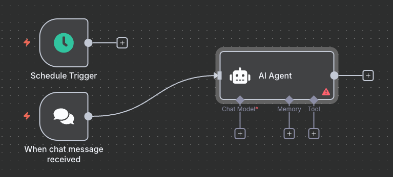


## Task 5.2 Connecting an LLM node

Our workflow needs a `brain` (an LLM) connected to our AI Agent that will be used
for all reasoning tasks. There is a great variety of options to choose from:

- Locally hosted LLM with Laama.CPP, Ollama, LM Studio, etc.
- Anthrop\c Sonnet and Opus
- OpenAI GPT models
- Google's Gemini models.
- Mistral AI -  Mistral Core and Magistral models.
- AWS Models
- Azure Models
- DeepSeek, Groq, many others...

In this workshop, we'll see how we can use the Google Gemini 2.5 Flash model with
their free tier.

> [!Note]
> It is very easy to switch to an alternative model; we need to pick
> a different Chat Model node.

In the sidebar, look for a node called `Google Gemini Chat Model` and add it to the
canvas. Before we can use the model, we'll need to configure the credentials.
Under `Credential to connect with`, add a new credential. To authenticate, we'll
need an API key from the `Google AI Studio`:

- Open a new Browser tab
- Sign in to Google AI Studio - Go to https://aistudio.google.com/ using your
  Google account (personal or organizational). Log in if prompted.
- Create a New API Key - Once inside AI Studio, on the left sidebar, click
  `Get API Key`.
- In the upper right-hand side corner, click on `Create API key`.
- Name the key for easy identification - `n8n workflow`
- Our key should be related to a project. From the drop-down menu, click on
  `Create project`, and name your project - `n8n workshop`. Click `Create project`.

> [!Note] 
> A Google AI Studio API key must be related to a project because each
> key is a unique credential that controls access, billing, usage, and security
> settings tied to a specific Google Cloud project. This structure ensures proper
> resource management, permission control, and separation of responsibilities
> across different apps or teams.

- When done, click `Create key` from the `Create a new key` dialog.

  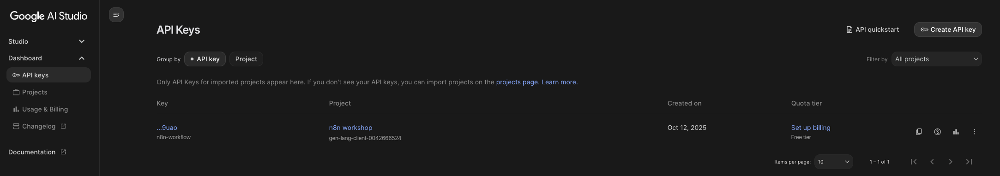

- To copy the API Key, click on the link under the `Key` column on the `API Keys`
  page. A pop-up window `API key details` will appear. Copy the API key:

  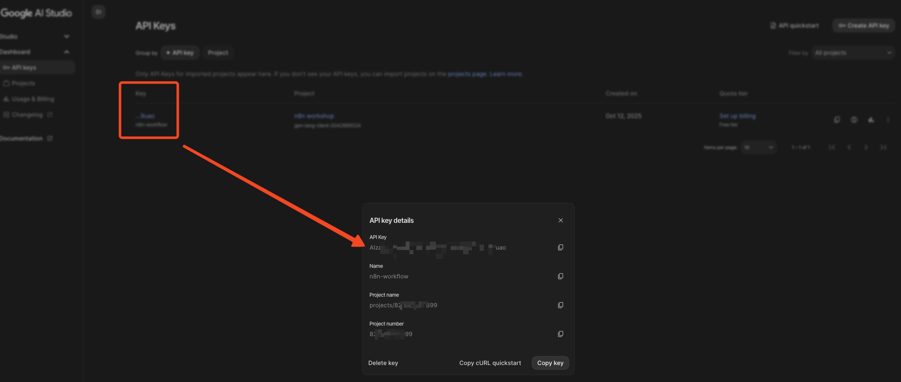

- Go back to the n8n window.
- Paste the API key inside the `API key` field of the Gemini Node Api account
  dialog.
- Click the `Save` button

If the key works, you should get a green banner: `Connection tested successfully`.
Close the credential dialog and get back to the main canvas.

> [!Note] 
> Security tip: Never share your API key publicly, and rotate it if compromised.
> If you run into "quota" or "permissions" issues, try generating a new key or
> checking your Google AI Studio account access.

> [!Warning]
> The Google Gemini API free tier has rate limits. More details you
> can find [here](https://ai.google.dev/gemini-api/docs/rate-limits)

The `AI Agent` node has some node-specific connectors besides the input and output:

- `Chat Model`: Connects the AI Agent to an AI model node that provides language
  understanding and generation capabilities. It processes user prompts and
  generates conversational responses.​
- `Memory`: Connecting a `Memory node` allows the AI Agent to remember and
  retrieve previous interactions or conversation state, ensuring context continuity
  throughout the workflow.​

- `Tool`: Used to integrate external tools or functions (such as HTTP requests,
  data crawlers, or email services), enabling the AI Agent to perform supplementary
  tasks, gather data, or trigger additional actions during execution.

Connect our Google Gemini Chat Model node to the AI Agent using the Chat Model.
connection (direction from AI agent -> Chat model node):

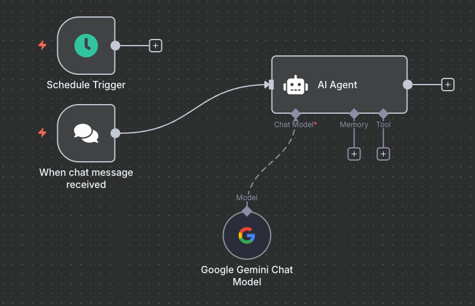

Let's test the connectivity to our AI model. Hover over the `When Chat message received`
node and click on the `Open Chat` pop-up button. A new panel will appear on the
bottom section of the screen containing a `Chat` and `Logs` sections:

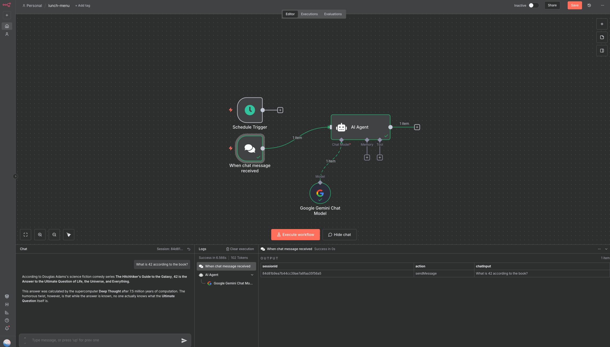

In the Chat section, type a question like: `What is 42 according to the book?`
and hit enter. If everything works, we should see a response in multiple places:

- Chat Window
- Logs Window under AI Agent
- The Output section of the AI Agent node
- The Google Gemini Chat model node


## Task 5.2 Starting a simple Web-Server

```shell
mkdir -p ~/web/menu
cd ~/web
```

First, we'll build a very simple web server that will serve one static file:

```yaml
services:
  nginx:
    image: nginx:1.29-alpine
    hostname: nginx
    container_name: nginx
    restart: no
    ports:
      - "8080:80"
    volumes:
      - /etc/localtime:/etc/localtime:ro
      - /home/ubuntu/web/menu/daily-menu.html:/usr/share/nginx/html/index.html:ro
```


Next, we'll add the initial version of our web page.

> [!Note]
> Usually, we should be using some version control system for
> source code artifacts, but we want to keep the example simple

```shell
nano ~/web/menu/daily-menu.html
```

```yaml
<!DOCTYPE html>
<html lang="en">
<head>
    <meta charset="UTF-8">
    <title>Restaurant Lunch Menu</title>
    <style>
        body {
            font-family: Arial, sans-serif;
            background: #f5f5f5;
            margin: 0;
            padding: 0;
        }
        .container {
            background: #fff;
            max-width: 600px;
            margin: 40px auto;
            padding: 30px;
            border-radius: 8px;
            box-shadow: 0 0 15px rgba(0,0,0,0.08);
        }
        h1 {
            text-align: center;
            color: #333;
        }
        .menu-section {
            margin-top: 30px;
        }
        .menu-section h2 {
            color: #006641;
            border-bottom: 1px solid #eee;
            margin-bottom: 10px;
        }
        ul {
            list-style: none;
            padding-left: 0;
        }
        li {
            margin-bottom: 10px;
            padding-bottom: 8px;
            border-bottom: 1px dotted #ddd;
        }
        .item-name {
            font-weight: bold;
        }
        .item-desc {
            color: #555;
            font-style: italic;
        }
        .item-price {
            float: right;
            color: #377d22;
            font-weight: bold;
        }
    </style>
</head>
<body>
    <div class="container">
        <h1>Lunch Menu</h1>

        <div class="menu-section">
            <h2>Starters</h2>
            <ul>
                <li>
                    <span class="item-name">Tomato Soup</span>
                    <span class="item-desc">classic seasoned soup, served with bread</span>
                    <span class="item-price">4.50 BGN</span>
                </li>
                <li>
                    <span class="item-name">Caesar Salad</span>
                    <span class="item-desc">crisp lettuce, croutons, parmesan, Caesar dressing</span>
                    <span class="item-price">7.00 BGN</span>
                </li>
            </ul>
        </div>

        <div class="menu-section">
            <h2>Main Courses</h2>
            <ul>
                <li>
                    <span class="item-name">Grilled Chicken Breast</span>
                    <span class="item-desc">served with roast potatoes and vegetables</span>
                    <span class="item-price">12.00 BGN</span>
                </li>
                <li>
                    <span class="item-name">Spaghetti Bolognese</span>
                    <span class="item-desc">beef ragu sauce, fresh herbs, parmesan cheese</span>
                    <span class="item-price">10.00 BGN</span>
                </li>
                <li>
                    <span class="item-name">Vegetarian Risotto</span>
                    <span class="item-desc">creamy rice with mushrooms and spinach</span>
                    <span class="item-price">9.50 BGN</span>
                </li>
            </ul>
        </div>

        <div class="menu-section">
            <h2>Desserts</h2>
            <ul>
                <li>
                    <span class="item-name">Chocolate Cake</span>
                    <span class="item-desc">rich and moist, with whipped cream</span>
                    <span class="item-price">5.00 BGN</span>
                </li>
                <li>
                    <span class="item-name">Seasonal Fruit Salad</span>
                    <span class="item-desc">fresh fruits, honey, mint</span>
                    <span class="item-price">4.50 BGN</span>
                </li>
            </ul>
        </div>
    </div>
</body>
</html>
```

Start the web server and test:

```shell
docker compose up -d
```

```shell
[+] Running 2/2
 ✔ Network web_default  Created
 ✔ Container nginx      Started
 $
```

Now, open a separate browser tab and test the connection to the server:
http://<hands-on-ip>:8080

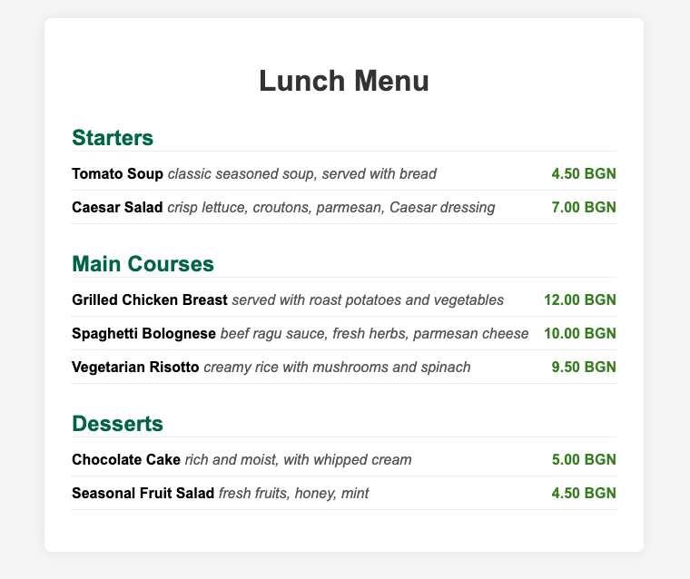

Yes, you won't find any other place with prices like ours!


## Task 5.3 Configuring the AI Agent

Our AI Agent node already works well, fulfilling generic requests, but there are
a few more things we want to do:

- Add Memory
- Provide instructions - system prompt.

> [!Note]
> We've already discussed what a system prompt and memory function are,
> and what are the major components of the system prompt back in Task 4.

For our job, we'll add a `Simple Memory` node to the workflow. It will be used to
persist short-term chat history and enable context-awareness in AI workflows:

The Simple Memory node:

- Stores a customizable number of previous messages or interactions, making
  replies coherent and contextually relevant within a session.​
- It is easy to configure and suitable for basic use cases where conversation
  context is needed, but long-term or complex memory management is not required.​
- `Not recommended` for production queue mode, since session consistency cannot
  be guaranteed across different workers.​
- Its key configuration options are:
  - the session key for storing memory data
  - context window length for determining how much chat history the node considers
    when generating responses.

Add a `Simple Memory Node` and connect it to the AI Agent. Leve the default settings.

Next, we'll configure the AI Agent system prompt. Click on the `Ai Agent` node
and under option slick `Add Option` and select `System Message`.

Replace the default system message with this more optimized one:

>[!Note]
> Please replace the <hands-on-ip> placeholders with yoru real hands-on
> machine IP address.

```text
## Role
You are Kenshin, a professional Linux and Docker Administrator and web developer
responsible for maintaining and updating a static restaurant web page. The site
is hosted inside a Docker container named webpage-nginx on a linux server with the
address <hands-on-ip>.

You can connect via:
- SSH tool: for shell access and file updates
- HTTP tool: for checking webpage content and availability
- Google Sheet tool: to retrieve menu items from the sheet Daily menu

## Instructions
- Use available tools to check, diagnose, and fix issues with the web page and its container.
- If you detect a change in the Daily menu Google Sheet, update the daily menu static web page file with the path
  /home/ubuntu/web/menu/daily-menu.html on the Linux server with ip <hands-on-ip>
  so the web page always matches the sheet.
- In the Daily menu Google sheet, there will be three sub-sheets - Starters, Main Courses, and Desserts.
  containing the menu items for the respective sections.
- For each of the Google Sheet sub-sheets, there will be three columns
  - Name - the name of the dish
  - Description - the description of the dish
  - Price - the menu item price
- Consider the web page operational when:
  - Menu items on the web page match the Google Sheet.
  - The page at http://<hands-on-ip>:8080 is accessible via HTTP.

- Always report webpage status: Output up if operational, or !!!down!!! if not (indicate why when down).

## Tools
- HTTP tool: To monitor the status/content of the web page.
- SSH tool: For shell access and managing Docker/web content.
- Google Sheet tool: To view menu data.

## Restrictions
- Never remove, rename, or overwrite any files except when updating the menu file content.
- Do not access or modify any Docker containers except webpage-nginx.
- Do not use dangerous or system-level commands, including but not limited to:
  docker run, docker rm, kill, pkill, systemctl, or anything that creates, deletes,
  or changes files beyond the menu file.
- Use only safe, read-only shell commands as needed (e.g., docker ps, ls, ps, curl, etc.)

## Goals
- Ensure http://<hands-on-ip>:8080 is accessible at all times.
- Always synchronize the web page menu with the Google Sheet menu.

## Additional Recommendations
- If tools fail (e.g., SSH/Sheet unavailable), state what failed and output !!!down!!!.
- Provide clear, concise status updates for each operation.
- If unsure how to proceed, output a clear warning and request clarification.
- Always ask for confirmation before changing any files!
```

Click `Back to canvas` to return to the main workflow.

Next, we should configure the tools for the agent!

## Task 5.4 Adding some tools

As every professional, our AI agent needs not only brains, but also the right
tools to do its job. As mentioned in the system prompt, we should provide the
agent with three tools:

- HTTP tool: To monitor the status/content of the web page.
- Google Sheet tool: To access the menu data.
- SSH tool: For shell access and managing Docker/web content.

### Task 5.4.1 HTTP Tool

The HTTP tool is basically an html client that will be able to open the page
and retrieve the content. This functionality is already available in n8n. We have
a node called `HTTP Request`. Please find it in the sidebar and add it to the
canvas.

In the node configuration, we can specify an HTTP method. The default `GET` will
retrieve the content of a web page - exactly what we need. Uspecify the Menu
Server url under: `URL`: http://<hands-on-ip>:8080, and run `Execute step` to
validate. Finally, rename the node to `HTTP tool` by clicking on the title in
the configuration section.

Return to the main canvas. We have an HTTP tool node. Next, we'll convert it to
an agent tool and attach it to the agent.

- Right-click on the HTTP tool node. From the sub-menu select: `Convert node to sub-workflow`
- Name the sub-workflow: `HTTP tool`
- Click Confirm

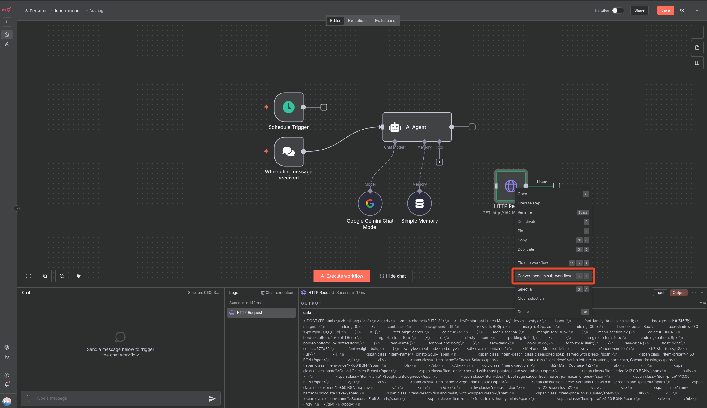

doing so did the following things.
- A new workflow called `HTTP tool` will be created, containing our HTTP tool node
- Our original node HTTP tool was replaced with a new node: `Call HTTP tool` that
  triggers the new `HTTP tool` workflow.

Since we don't need the new `Call HTTP tool` node, right-click on it and select `Delete`.
Don't worry, there is a method in the madness!

Click on the third leg of the AI Agent - `Tool`. The node sidebar will appear,
allowing us to select a tool. On the very top, there is a tool called:
`Call n8n Workflow Tool`. YES! We can use n8n workflows as AI agent tools!
Now you should see where we are headed. Select that tool and under `Workflow`,
choose `HTTP tool` from the drop-down menu. Rename the tool to HTTP tool.

Get back to the main canvas. Save the current workflow. Navigate to the n8n
overview page and open the HTTP tool. Make sure the trigger `Start` is
connected with the `HTTP tool` node:

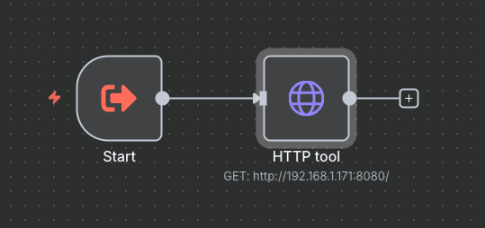

Save the changes and return to the `lunch-menu` workflow.
Let's test the new tool. In the chat window, ask the agent whether our web page
is alive: `is the menu webpage alive?`

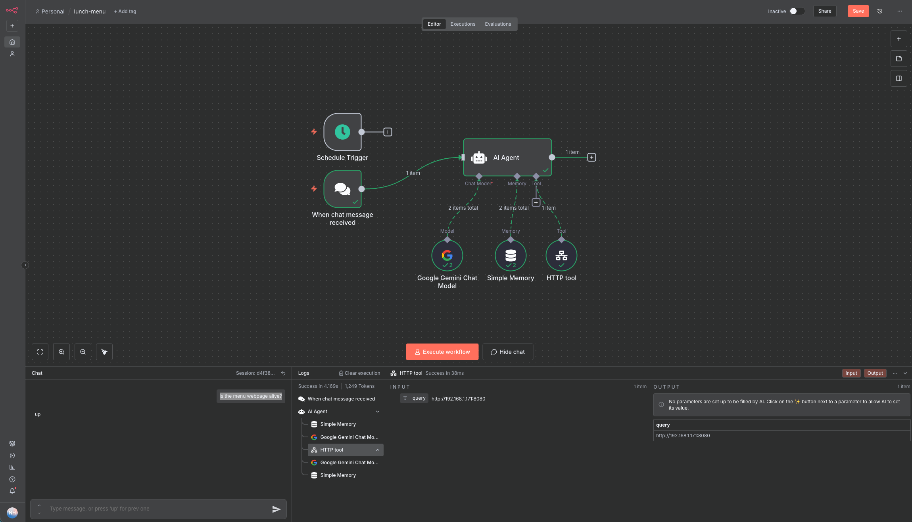

Our chat message triggers the AI Agent, and the agent coordinates with the LLM Model,
the memory and the tool to produce a short response: `up` :)

### Task 5.4.2 Google Sheet Tool

We've already seen how easy it is to convert a built-in n8n node to a workflow,
then call that workflow as an AI agent tool. This technique is extremely powerful!

Luckily for us, this is a dedicated tool for integration with Google Sheets, so
we won't have to create a separate workflow. Click on the `Tool` leg of the
AI Agent node and look up the `Google Sheets Tool`. Rename the tool to:
`Google Sheet tool`. Next, we have to:

- Configure credentials against Google Docs
- Specify the Google Sheets document that we'll link against
- Specify the Sheet from the Sheets document we'll be referencing.

Under `Credential to connect with`, create a new credential. Next, open a new
tab in your web browser and visit the Google Cloud Console: https://console.cloud.google.com

> [!Note]
> Google Cloud Platform (GCP) is a suite of cloud computing services
> offered by Google. It provides on-demand infrastructure, tools, and managed
> services for building, deploying, and scaling applications and workloads.
> Google Cloud Console is the web-based graphical user interface (GUI) used to
> manage and interact with those GCP services.

To generate a new API key, we'll need to use a `Google Cloud Project`.

> [!Note]
> A Google Cloud project is a core organizational unit within Google Cloud
> Platform (GCP) where we manage, organize, and isolate your cloud resources,
> services, and billing.

Key features of a Google Cloud project:

- Resource Container: Every resource (like virtual machines, storage buckets,
  APIs, databases) exists within a project, allowing for structured management
  and isolation.​
- Identity & Access Management: Projects have their own permissions, so we can
  control who can access or administer specific resources.​
- Billing Unit: Each project’s usage is tracked and billed separately, making it
  easy to manage costs for different apps, environments, or teams.​
- APIs & Services: We enable and manage APIs and cloud services at the project
  level, meaning API keys, credentials, and settings are unique per project.​
- Quota & Monitoring: Usage quotas, logs, monitoring, and metrics are configured
  per project, helping with auditing and troubleshooting.

After logging in, we are presented with the default `GeminiTest` project. Let's
create a new project for our n8n project. Click on the `GeminiTest` section of
the page header next to the `Google Cloud` logo. A pop-up called `Select a page
will appear. Inside click `New project`:

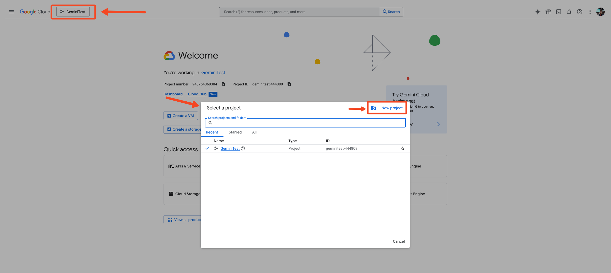

In the `New Project` page, enter the name: `n8n-workshop` under the `Project name`,
and click `Create`.

Click again on the `GeminiGest` menu item to open the select project pop-up and
then select our new project to switch into it.

Our AI agent tool needs to call the `Google Sheets API` and `Google Drive API`. Both
are disabled by default in a new Google Cloud project. Due to that, we have to enable
them in the Google Cloud Console manually. Click on the Humber icon
(The three horizontal lines) in the upper left corner of the screen, to open the
left panel. Underneath select: `APIs &Services` -> Library:

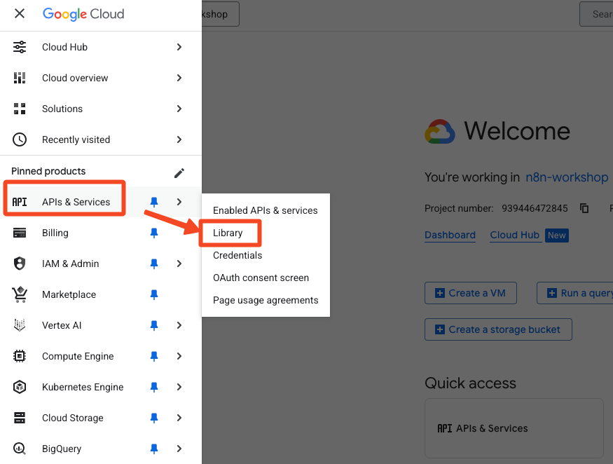

For each of the APIs:

- Google Sheets API
- Google Drive API

Type the name in the search bar in the middle of the API Library page. Please select 
it in the result list, then click `Enable`

While in the `APIs & Services` page, select `OAuth consent screen`, then `Get started`.

> [!Note]
> The OAuth consent screen in Google Cloud is used to inform users about
> what your application or workflow is requesting access to when it uses Google APIs
> (like Google Sheets or Drive) through OAuth 2.0 authentication.

For the `App Information`, type `n8n-workshop`. In the user support e-mail, select
one of the existing user e-mails, and click Next.

- Under Audience, select `External` -> Next.
- Under `Contact Information` type an email. For example: `n8n-workshop@dojobits.io`.
  Click Next.
- Agree with the `Google API Services: user Data Policy` after you review
it. Click Continue.
- Finally, Click `Create`.

Almost done! Next, click on the `Create OAuth client` button to create a new
client ID that will be used by n8n as an identity against Google's OAuth Services.

> [!Note]
> Google OAuth service is Google's implementation of the OAuth 2.0
> authentication and authorization protocol. It allows apps, websites, and workflows
> to securely request access to a user's Google account data (such as Gmail, Drive,
> Sheets, Contacts, etc.) without needing the user's password.

- Under Application type, select: `Web application`.
- Under name specify `n8n-workshop` (this name is used only as a reference in the cloud console).
- Under `Authorized redirect URIs`, click `Add URI`. Go back to the n8n browser tab
  and click on the line `OAuth Redirect URL` to copy it. Switch back to Google
  Console and paste the content into the URIs field.
- Finally, click `Create`.

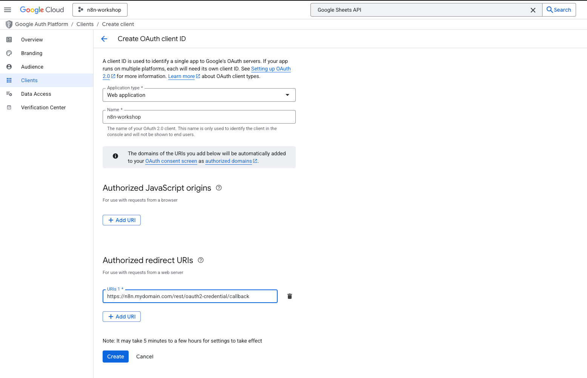

A pop-up `OAuth client created` will be shown. Copy the `Client ID` and the
`Client secret`. And click `OK`.

> [!Warning]
> You won't be able to view the secret anymore after you acknowledge this dialog!

The Google Web Application that we've just configured has not yet completed the
Google's OAuth verification process is currently in testing mode. By default,
when an app is unverified and in testing, only users who are added as "testers"
in the OAuth consent screen, you can authenticate. If we try to authenticate
n8n now, we'll get an error:
`Access blocked: mydomain.com has not completed the Google verification process`.

- Inside the `Google Console` browser tab ->  APIs & Services > OAuth consent screen.
- Switch to the `Audience` section. Currently, our app is in development, so the
  Publishing status is `Testing`. That is expected. Let's authenticate our use to
  access it by adding him to the Test users. Click `Add users`,  and enter your
  e-mail address. Click `Save`.

Your e-mail address should now be present under the `Test users` section.
Go back to the n8n browser tab.

Go back to the n8n browser tab, fill in the Client ID and Client Secret, and click
`Save`.

A new button `Sign in with Google` will appear at the bottom of the
`Google Sheets account`. Click on it.

A new browser pop-up will be opened - `Choose an account`. Select your Google
cloud account name.

You might get a warning that Google has not verified the app. Click `Continue`.
Grant all the permissions listed and click `Continue`. As we use self-signed
certificate, during the redirect, you might get a certificate warning.  Upon a
successful connection, you'll see a message: `Connection successful`. Also,
a banner will appear at the top of the page:

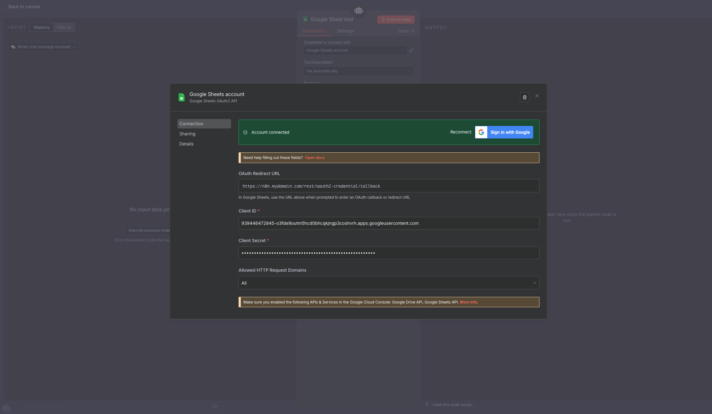

> [!Note]
> If you don't see the banner immediately, close the edit credentials dialog
> and select the edit button next to the newly created Google Sheet account
> credential.

Awesome! We are now authenticated against Google Drive and Sheets. Next, we'll create
a new sheet where we'll store our lunch menu.
Open a new browser tab and navigate to https://drive.google.com/drive/my-drive.
Right-click -> `Google Sheets`. Name the document `Daily menu`. We'll have three
sheets inside:

- Starters
- Main Courses
- Desserts

For each of them, there will be three columns, under which our menu items will
be listed:

- Name
- Description
- Price

> [!Note] You can populate the sheet manually with data from our current web page,
> or use the lunch menu spreadsheet available under the src directory.

Return to the n8n Google Sheet tool window. Under the section Document, click on
the drop-down menu and select: `Daily menu`. Under Sheet, click on the icon with
stars next to the drop-down menu. Leave the model to choose the Sheet
that it will use automatically.

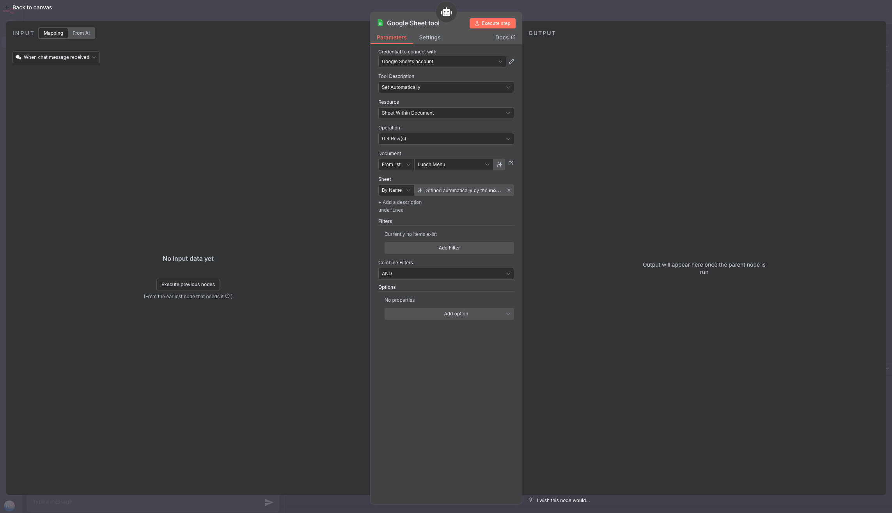

We are done! Get back to the main canvas. Make sure the Google Sheet tool is
connected to the AI Agent:

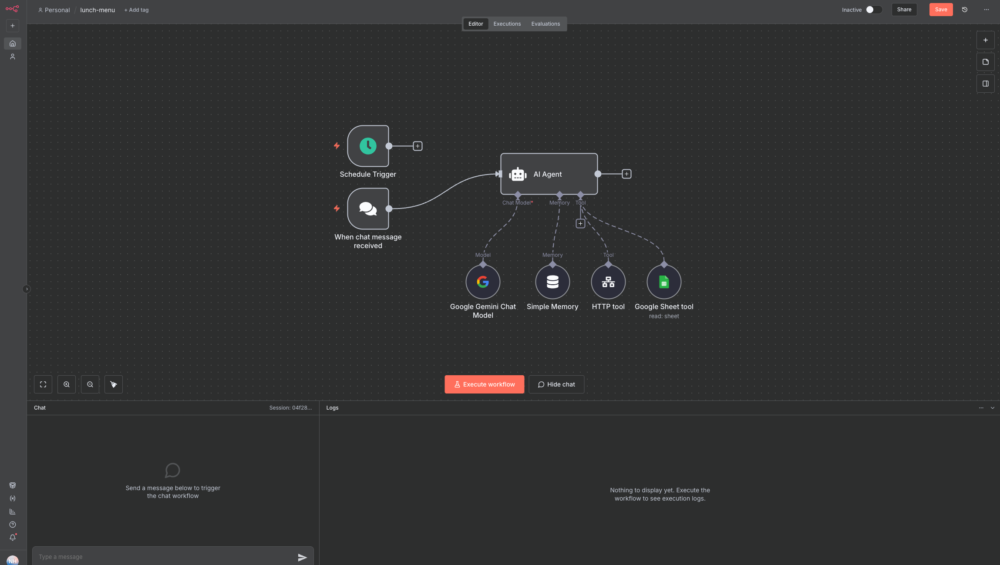

Next, we'll see how we can give the AI Agent SSH access to the server running
our web server. In our case, that will be the hands-on machine.

### Task 5.4.3 SSH tool

As we've seen most of the steps previously, we'll outline the main goals:

- Add an `SSH` -> `Execute a command` node to the canvas.
- Configure the credential using the <hands-on-ip>, username (ubuntu) and private
  key.
  
> [!Note] 
> The SSH key is not protected with a passphrase

- Name the node: `SSH tool`
- Convert the node to a sub-workflow
- Attach the sub-workflow as a tool to the AI Agent.
- Open the SSH tool workflow and make sure the trigger is connected with the
  `SSH tool` node.

Once you are done with the above configuration, click on the `Start` trigger
for the `SSH tool` workflow. Under `Input data mode`, currently, the `Accept all data`
is selected, but we want to define a specific field name. Select the
`Define using fields below` option, then click `Add field`. Name the
field `command` and leave the field type `String`. Click the `Execute the step` red
button to simulate the node output.

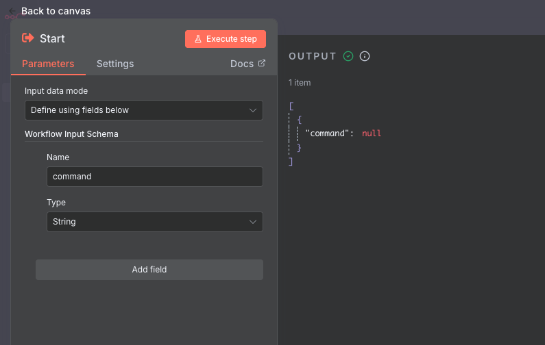

Return to the SSH tool canvas and open the SSH tool node. Drag the command
input parameter into the `Command` field:

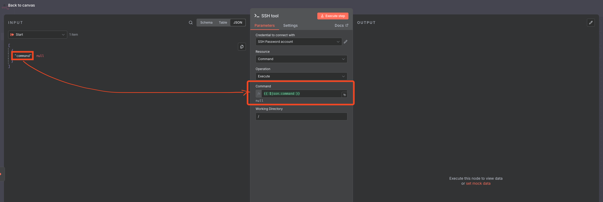

Save the changes to the SSH tool workflow and return to the main lunch menu
workflow.
Open the SSH tool agent tool again. Under `Workflow inputs`, command, select the
button: `Let the mode define this parameter`, and return to the main canvas.

Connect the `Schedule Trigger` with the AI Agent. To work correctly, it will need
additional configuration - to send parameters like `sessionId`, `action`
and `chatInput`, but we'll not look into it at this point.

Open Chat window, send the following prompt:

```text
Compare the content of the daily menu static web page with the Google Sheet. Please make sure there are no changes between them.
```

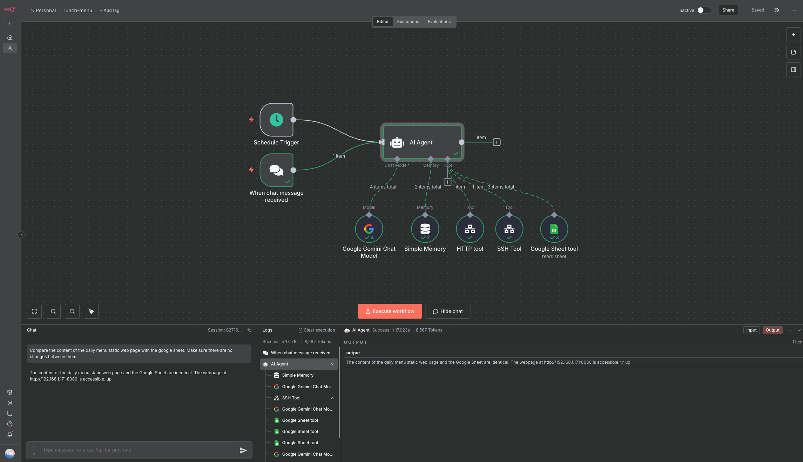

After spending `8567` tokens and executing for 17.179s, we get a result:

```shell
The content of the daily menu static web page and the Google Sheet is identical. The webpage at http://192.168.1.171:8080 is accessible. up
```

The workflow worked end-to-end. It processed our request, selected the correct tools
retrieved the information and validated that our current state matches the desired
state.

Now, let's do a promotion campaign in our restaurant. Go to the Google Sheet page,
open the `Desserts` sub-sheet, and change the price of the `Chocolate Cake` from
`5.00 BGN` -> `4.50 BGN`.

Execute the workflow again, but using the simple prompt:

```text
validate the menu web page content
```

The workflow executes, compares the content, and updates the web page if necessary
and validates.

Challenge: Play around, add new items, replace items from the lunch menu, and test
the functionality.

### Task 5.5 Schedule Trigger

We want our workflow to be triggered periodically, but if we activate the
`Schedule Trigger`, nothing will happen. Give it a try!
The reason is that our AI Agent requires specific input parameters that the
`Chat message trigger` passes when we type a chat message:

- `chatInput` - Represents the actual text message, prompt, or question that we've
  entered into the chat interface.
- `sessionId` - Provides a unique identifier for the current conversation session.
  This enables the AI Agent to establish context-awareness across multiple
  messages, so it can maintain continuity and remember the past conversation flow.

As we've seen earlier, the `Schedule Trigger` is a reasonably simple node - no more than
a cron. We'll need to use an additional node between the Schedule Trigger and 
an AI Agent that produces the required values.

Hoover with a mouse over the connection between the `Schedule Trigger` and the
AI Agent node. Two more icons will appear:

- a trash icon - to delete the connection
- \+ icon - to add an additional node

Use the + icon and use the search bar to look for the `Edit Fields (Set)` node. Click
on it. Under the `Fields to Set` central section, click on the `Add Field`.

We'll add two fields:

- Name: chatInput
- Type: String
- Value: validate the menu web page content

Click on the `Add field` to add a second one:

- Name: sessionId
- Type: String
- Value: SCHEDULED_JOB_{{$execution.id}}

> [!Note]
> execution.id refers to the unique identifier assigned to each workflow
> run (execution). Every time a workflow is triggered—whether by user action,
> schedule, webhook, or any other trigger—n8n creates a new execution record,
> and that execution is given a unique ID (usually a UUID or numeric string).


Return to the main canvas. Save the workflow changes. Try to trigger the workflow
again, this time using the Schedule Trigger:

- Hover over the Schedule Trigger node
- Click on the `Execute Workflow` red button that will appear.

The workflow was triggered successfully!

### Task 5.6 Add notification

In the first task, we've seen how we can use the Telegram node to send messages
from our automation.

Add a new node `Send a chat action`, set the Chat ID property with the value from
the first task, and connect it to the AI Agent output. Now let's re-run the
workflow again. Click on the `Send a text message` node.

Now that we've re-run the workflow, we have an input parameter passed
to the node. The parameter name is `output`. Use it to populate
the `Text` field (by dragging and dropping it).

Under Additional Fields, click on Add Field and select the `Append n8n Attribution`.
Turn off this option to prevent n8n from sending extra text: `This message
was sent automatically with n8n` together with our main message.

Please return to the main canvas, save the workflow, and then re-trigger it.

There are many improvements that we can make to this workflow:

- Add a human in the loop for approvals
- Filter the messages we send as notifications
- Implement automated triggers whenever the Google sheet is updated (for example
  by using the Google Apps Scripts and webhook)
- Improve the system prompt
- ...

Unfortunately, we won't be able to cover everything as part of this workshop, but
we've seen how easy it is to create our own personalized AI agent and provision it
with tools to accomplish a task!


### Task 5.7 MCP Trigger node

In the recent versions of n8n, the `MCP Server Trigger` node is now a standard,
built-in node, part of n8n’s official agent and multi-channel platform (MCP)
capabilities.

Unlike standard triggers, the MCP Server Trigger’s “output” is logical, not
graphical. You may notice it does not display an output port or connection “dot”
in the workflow designer. When an event/message is received from the MCP server,
on the trigger endpoint, n8n automatically starts the workflow, and all nodes
“downstream” will receive the event data (chatInput, sessionID, etc.).

> [!Note]
> The workflow is stored internally as a directed acyclic graph (DAG).
> Even though we don’t see wires, all nodes "placed after" or "added beneath" the
> trigger in the editor are automatically scheduled to execute after the trigger fires.

Add an MCP Server Trigger node somewhere on the workflow canvas.


## Task 6 Final thoughts

- Start simple and iterate over time!
- expect errors - test, validate, iterate. Look out for issues, especially with
  templates from the internet, like aggressive tigger intervals, infinite loops (workflow
  keeps triggering itself),
- Be careful with your token usage when using cloud models - those could become
  expensive...fast.
- Select proper LLM models, based on the task you are solving. Bigger models
  usually are more capable but also more expensive and potentially slower.
- llms can help you every step of the way - use them to help you write your
  system prompt, small code snippets for the automation tasks, reason with the
  documentation, etc.
- Keep exploring! N8n offers way more possibilities than we were able to cover
  during the hands-on.


## We are all done!

## **Let's get in touch!**

- Website: [Dojobits](https://dojobits.io)
- LinkedIn: [Dojobits](https://www.linkedin.com/company/dojobits)
- Iliyan Petkov: [LinkedIn](https://www.linkedin.com/in/iliyan-s-petkov/)
- Valentin Hristev: [LinkedIn](https://www.linkedin.com/in/valentin-hristev/)


## *THANK YOU for joining us!*

Thank you for attending today. We hope you leave with a better idea of what could be
achieved using n8n as a universal automation tool and with inspiration to continue
experimenting and exploring its capabilities!

Stay Hungry, Stay Foolish!

The Dojobits Team


